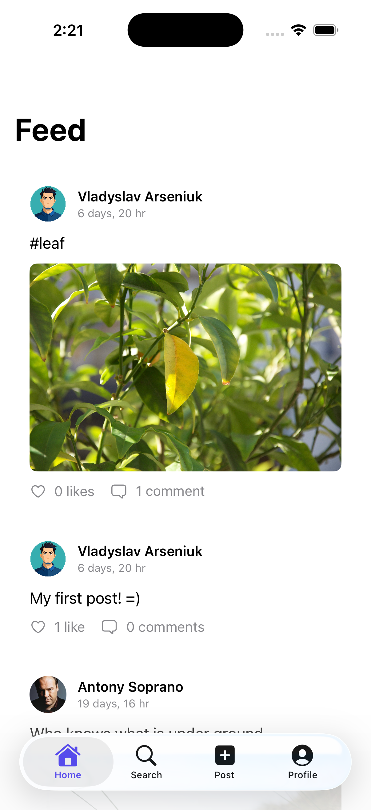
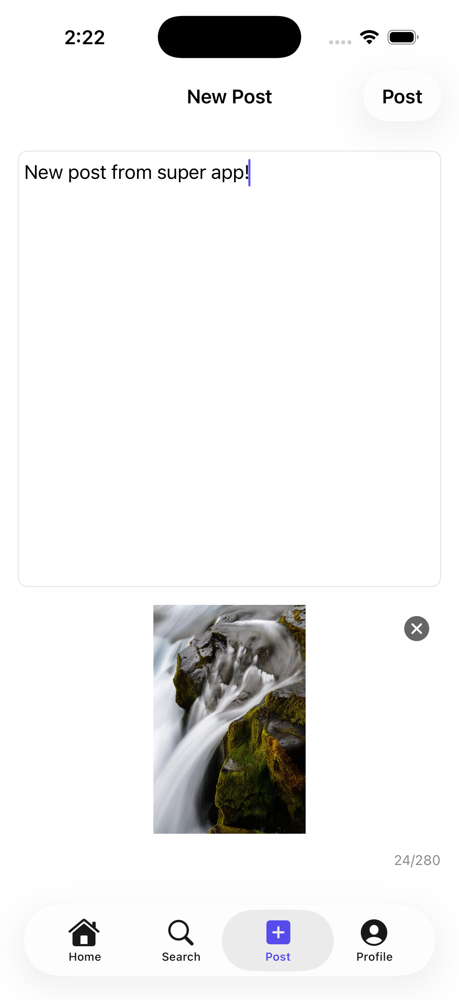
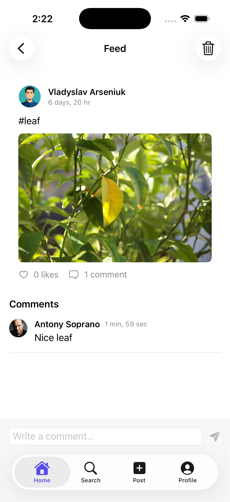
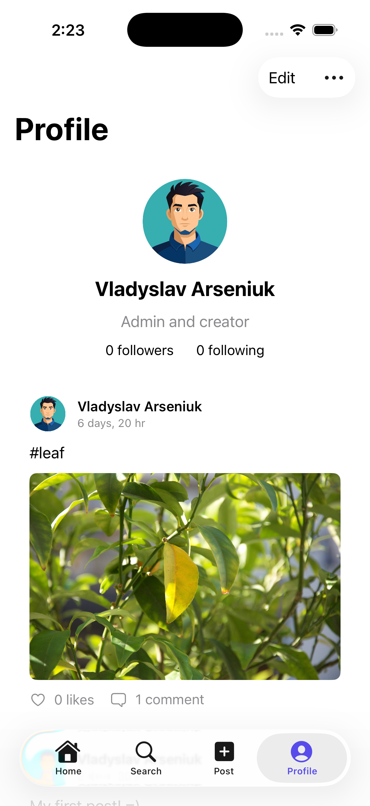
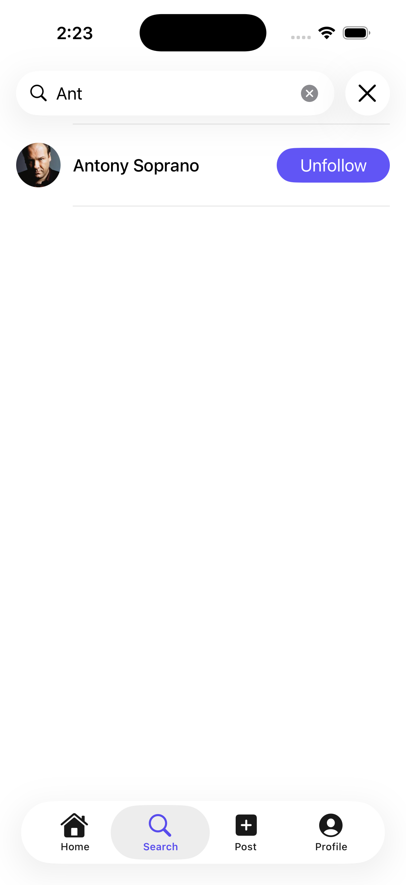

# Social Media Mini-Platform (SMMP)

A portfolio iOS application — a miniature social network with authentication, a real-time feed, profiles, user search, a follow graph, and offline support.

Built to demonstrate production-style mobile engineering: layered MVVM architecture, coordinator-based navigation, Firebase backend integration, CoreData offline caching, reactive connectivity handling, localization, and broad unit test coverage.

**Stack:** Swift 5 · SwiftUI · Firebase (Auth, Firestore, Storage) · CoreData · async/await

**Status:** Core product complete (Phases 1–5). Release prep (TestFlight, Crashlytics, App Store assets) not started.

---

## Features

- **Authentication** — Email/password sign-in and registration, password reset, session persistence, splash while resolving auth state
- **Feed** — Follow-scoped chronological feed with real-time updates, pull-to-refresh, pagination, and optimistic like/unlike
- **Posts** — Create posts with text and images (client-side resize before upload); view post detail with comments
- **Profiles** — View and edit profile (display name, bio, photo); follower/following counts
- **Discovery** — Debounced user search with inline follow/unfollow
- **Social graph** — Follow and unfollow users; dedicated following list
- **Offline mode** — Browse cached feed and profiles without connectivity; writes disabled offline with clear UI feedback
- **Polish** — Skeleton loading states, heart animation on like, haptic feedback, shared offline banner

---

## Screenshots

Add PNG captures to [`docs/screenshots/`](docs/screenshots/) using the filenames below.

| Screen | File |
|--------|------|
| Feed | `feed.png` |
| Create post | `create-post.png` |
| Post detail | `post-detail.png` |
| Profile | `profile.png` |
| Search | `search.png` |
| Offline mode | `offline.png` |

<p align="center">
  
  
  
</p>
<p align="center">
  
  
  
</p>

---

## Architecture

The app follows **MVVM** with clean layers: Views → ViewModels → Repositories → Services / Persistence.

```
┌────────────────────────────────────────────────────────┐
│                      SwiftUI Views                      │
├────────────────────────────────────────────────────────┤
│                      ViewModels                         │
├────────────────────────────────────────────────────────┤
│                      Repositories                       │
├──────────────────────┬─────────────────────────────────┤
│   Firebase Services  │      CoreData Persistence        │
│  (Auth, Firestore,   │  (User, Post, Comment cache)    │
│   Storage)           │                                  │
└──────────────────────┴─────────────────────────────────┘
```

**Navigation** uses a coordinator–router–builder pattern: session-driven root flow (`AppCoordinator`), per-tab navigation stacks, and protocol-based routing for testability.

**Data flow:** Repositories own Firestore listeners and CoreData writes. Reads serve from the network when online and fall back to cache offline. Writes go to Firestore; the real-time listener keeps the local cache in sync.

**Dependency injection:** `AppDependencies` is created at app launch and passed into coordinators and view builders. ViewModels receive services through initializers, making mocks straightforward in tests.

---

## Project Structure

```
smmp/
├── App/              App entry, dependency container
├── Domain/           Models, protocols, shared utilities
├── Data/             Repositories, Firebase services, CoreData, mappers
└── UI/               Views, ViewModels, Coordinators, Routes, Navigation

smmpTests/            Unit and integration tests (ViewModels, repos, coordinators)

firebase/             Reference Firestore security rules
openspec/             Formal capability specs (auth, feed, posts, profiles, …)
```

---

## Testing

The test suite (`smmpTests/`, 27 files) focuses on business logic and data layers rather than UI snapshots:

- **ViewModels** — Login, registration, feed, post detail, profile, search, user profile
- **Repositories** — Posts, profiles, follows, local cache, offline paths
- **Services** — Session, network monitor, media upload
- **Navigation** — Router, coordinators, route builders
- **Mapping** — Firestore document → domain model parsing

Tests use mock services and in-memory CoreData where appropriate.

---

## Notable Decisions

| Decision | Rationale |
|----------|-----------|
| Flat CoreData IDs mirroring Firestore | Simpler sync mapping; no CoreData relationships across entities |
| Coordinator–router–builder navigation | Separates routing from views; coordinators stay thin and testable |
| Per-screen auth ViewModels | `LoginViewModel` / `RegistrationViewModel` instead of one shared auth VM |
| AsyncImage for post images | Avoids an extra image-caching dependency for portfolio scope |
| Follow-scoped feed | Feed shows posts from followed users plus own posts |
| 30-following cap | Guardrail on follow graph size |
| Followers list deferred | Follower count on profile; full followers screen out of scope |
| Offline-first reads | CoreData cache backs feed and profiles; writes blocked when disconnected |
| String Catalog localization | Semantic keys with generated symbols; SwiftLint enforces no hardcoded UI strings |

---

## Scope & Limitations

**Included:** Auth, feed, posts, comments, likes, profiles, search, follow/unfollow, following list, offline browsing, UI polish (skeletons, haptics, animations).

**Not included:**

- Followers list screen (count only on profile)
- Push notifications
- `matchedGeometryEffect` post transitions
- Instruments profiling pass
- UI test suite (unit/integration tests instead)
- App Store / TestFlight release prep

---

## Specs

Detailed capability requirements live in [`openspec/specs/`](openspec/specs/) (authentication, feed, posts, comments, profiles, navigation, localization, security rules).
